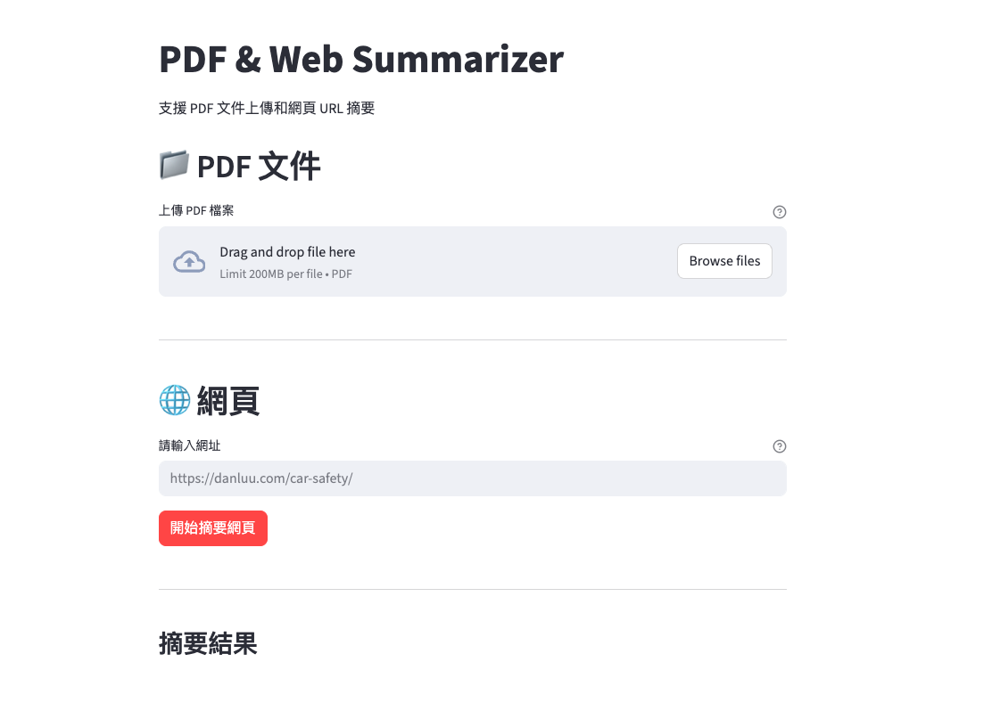

# PDF & Web Summarizer

基於 Ollama 本地 AI 模型的文件摘要工具，支援 PDF 和網頁文章的處理。

## 主要功能

- **多格式支援**: PDF上傳、網頁連結自動識別
- **本地AI處理**: 使用 Ollama 模型，保護隱私安全
- **即時顯示**: 摘要生成過程即時可見



---

## Tech Stack

| Component          |                                                                            |
| ------------------ | -------------------------------------------------------------------------- |
| **Frontend**       | [Streamlit](https://streamlit.io/)                                         |
| **LLM Platform**   | [Ollama](https://ollama.com/)                                              |
| **LLM Model**      | [Google Gemma 3](https://developers.googleblog.com/en/introducing-gemma3/) |
| **PDF Processing** | [PyPDF2](https://pypi.org/project/PyPDF2/)                                 |

---

## Installation & Setup

### Clone the Repository

```bash
git clone https://github.com/sydchen/html_pdf_summarizer.git
cd html_pdf_summarizer
```

### Install Dependencies

```bash
pip install -r requirements.txt
```

### Install Ollama and Gemma 3 LLM

Install Ollama - MacOS/Linux

```bash
curl -fsSL https://ollama.com/install.sh | sh
```

### Start Ollama and download Gemma 3 Model

```bash
ollama serve & ollama pull gemma3:4b
```

### Start the Frontend (Streamlit)

```bash
streamlit run frontend.py
```
